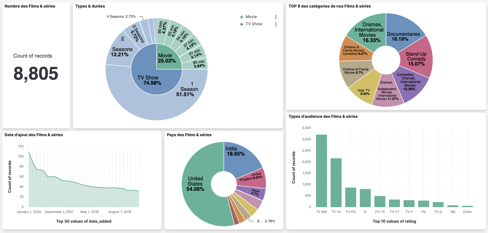

# Nest.js Elasticsearch API

Ce projet est une application Nest.js qui utilise Elasticsearch pour fournir une API. Cette API permet aux utilisateurs d'effectuer des opérations de recherche avancées dans un index Elasticsearch et d'indexer de nouveaux jeux de données de manière efficace. Ainsi, toutes nos routes API et fonctionnalités Front sont compatibles avec n'importe quel jeu de données indexé dans Elasticsearch.

## Liens des partie front-end et back-end(api) de l'appication
[Projet react](https://github.com/Flunshield/frontElasticSearch)  
[Api nestJs](https://github.com/kbegot/back-app-elasticsearch)

## Prérequis

Avant de commencer, assurez-vous d'avoir les éléments suivants installés sur votre machine :

- Node.js
- npm (ou yarn)
- Elasticsearch

## Installation

1. Clonez ce dépôt sur votre machine :

```bash
git clone https://github.com/kbegot/back-app-elasticsearch
```

2. Accédez au répertoire du projet :

```bash
cd back-app-elasticsearch
```

3. Installez les dépendances du projet :

```bash
npm install
```

## Configuration

1. Assurez-vous que Elasticsearch est en cours d'exécution sur votre machine. Si ce n'est pas le cas, vous pouvez le télécharger et l'installer à partir du [site officiel d'Elasticsearch](https://www.elastic.co/downloads/elasticsearch). Vous avez également la possibilité d'utiliser la version cloud d'Elasticsearch proposée par Elastic.

2. Créez un fichier `.env` à la racine du projet avec les configurations Elasticsearch nécessaires. Par exemple :

```
ELASTICSEARCH_NODE_URL=http://localhost:9200
ELASTICSEARCH_API_KEY=YOUR_API_KEY
```

## Démarrage de l'API

Une fois les dépendances installées et la configuration terminée, vous pouvez démarrer l'API en exécutant la commande suivante :

```bash
docker compose up --build
```

L'API devrait démarrer sur le port par défaut `3000`.

## Utilisation de l'API

L'API fournit les endpoints suivants :

- `POST /elasticsearch/createIndex` : Crée un nouvel index dans Elasticsearch. Cette route permet d'indexer un nouveau document dans Elasticsearch.
- `GET /elasticsearch/getAllIndexes` : Récupère la liste de tous les index avec leurs IDs. Cette route permet de lister tous les index existants dans Elasticsearch.
- `GET /elasticsearch/getIndex` : Récupère la liste des index avec prise en charge de la pagination. Cette route permet d'obtenir une liste d'index spécifiques avec une pagination personnalisable en utilisant la fonction
- `GET /elasticsearch/search` : Recherche dans un index spécifique avec prise en charge de la pagination. Cette route permet de rechercher des éléments dans un index spécifique avec une pagination personnalisable en utilisant la fonction 
- `GET /elasticsearch/getAllColumns` : Récupère le mapping des propriétés pour l'index spécifié. Cette route permet de récupérer le mapping des propriétés pour un index spécifique.
- `GET /elasticsearch/aggregation` : Récupère les données agrégées sur l'index en fonction du type spécifié.

# Système de recherche

Nous avons mis en place un système de recherche dynamique permettant à nos utilisateurs d'effectuer des recherches précises sur n'importe quel champ de leurs propres jeux de données. Cette fonctionnalité offre également la possibilité de croiser plusieurs filtres pour affiner les résultats et obtenir une précision maximale.

## Création d'une pipeline pour changer un type de variable

Type de la variable existante :
``` json
    "country": {
      "type": "text",
      "fielddata": true
    },
```

Création de la pippeline :
````json
PUT _ingest/pipeline/changer_type_country
{
  "description": "Changer le type du champ country de text à keyword",
  "processors": [
    {
      "set": {
        "field": "country",
        "value": "{{country}}",
        "override": true
      }
    }
  ]
}
````

Application de la pipeline sur son index

````json
POST /_reindex
{
  "source": {
    "index": "netflix_title"
  },
  "dest": {
    "index": "netflix_title_modifie",
    "pipeline": "changer_type_country"
  }
}
````

Résulat obtenue :
````json
        "country": {
          "type": "text",
          "fields": {
            "keyword": {
              "type": "keyword",
              "ignore_above": 256
            }
          }
        },
````

## Création du dashboard pour nôtre jeux de données 



# Description du Dashboard

Le dashboard présente une analyse des données relatives aux enregistrements. Voici une vue d'ensemble des différents éléments présents :
- **Nombre de Records :** Ce compteur indique le nombre total de records présents dans le dataset.
- **Répartition des Types de Records :** Ce donut chart permet de visualiser la répartition des enregistrements par type (TV Show ou Movie). De plus, il affiche la durée associée à chaque type.
- **Historique des Ajouts :** Ce graphique montre la fréquence des ajouts de films et de séries au fil du temps, avec un décompte par année.
- **Top 9 des Pays :** Ce donut chart met en avant les neuf pays les plus représentés dans notre dataset de films et séries.
- **Répartition des Catégories d'Audience :** Ce graphique illustre la répartition des différentes catégories d'audience attribuées à nos films et séries.
Chaque élément contribue à offrir une compréhension approfondie des données et des tendances présentes dans notre ensemble de données.
